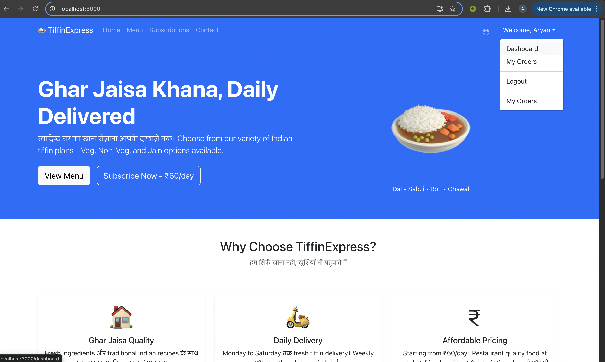
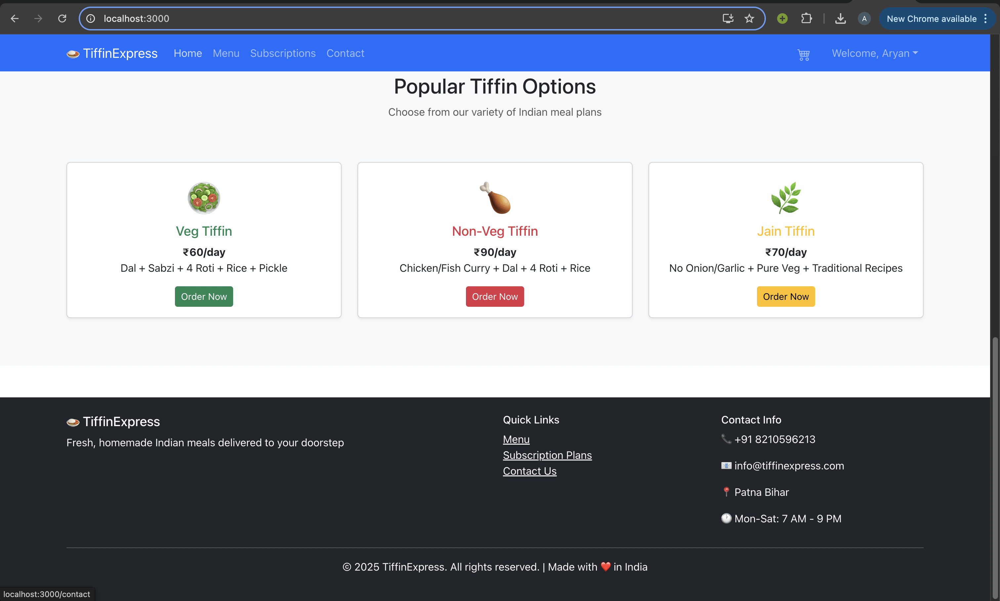
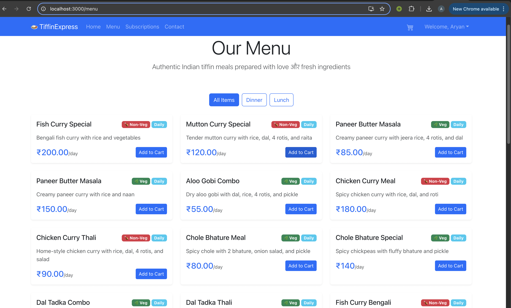
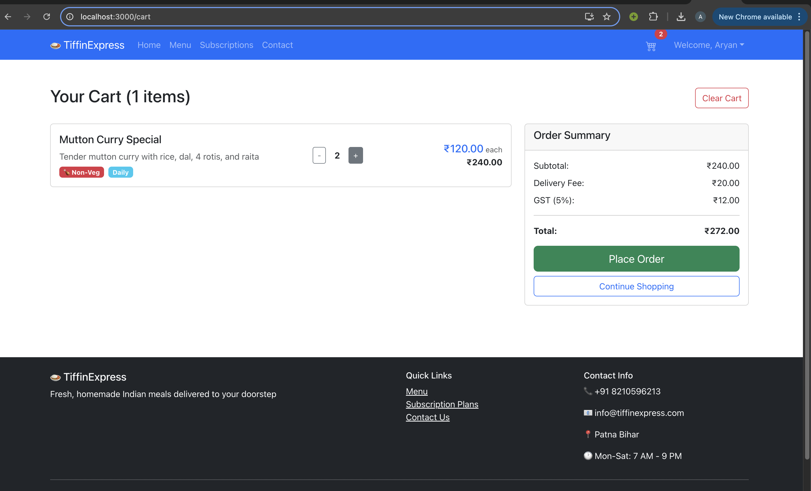
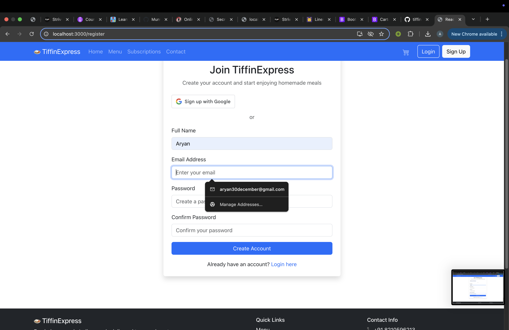
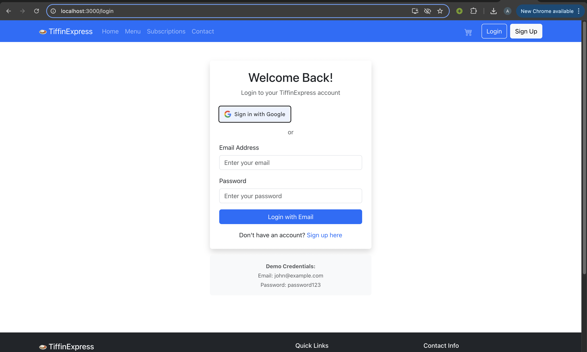
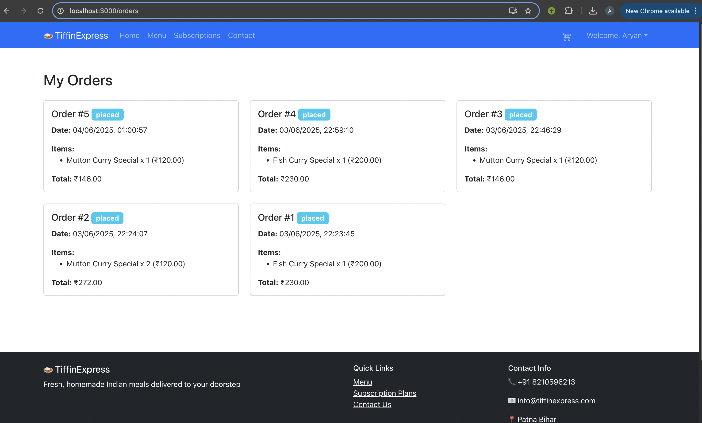
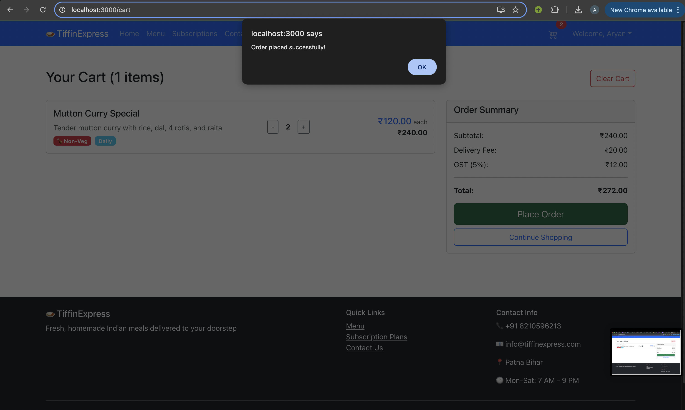
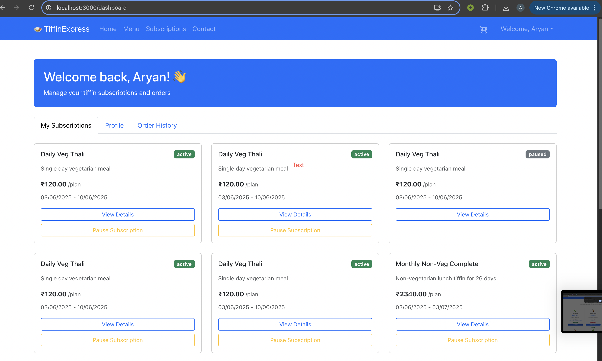
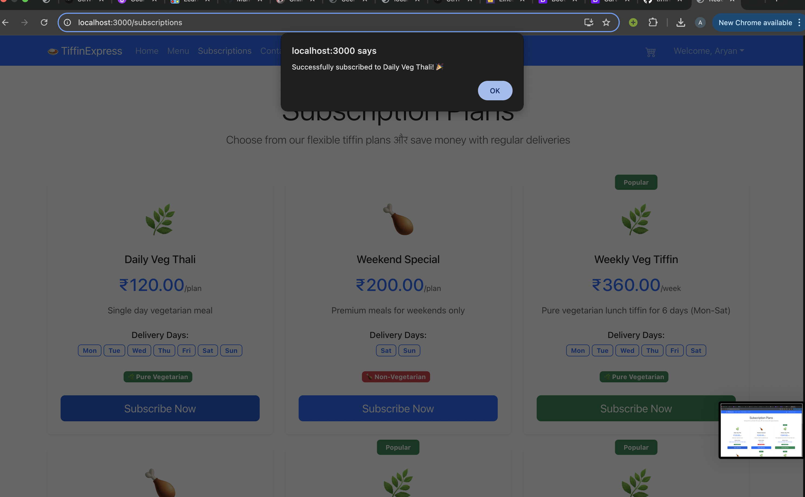

# TiffinExpress 🍛

A modern, full-stack Indian tiffin subscription and ordering platform.  
Built with React, Node.js, Express, and PostgreSQL.

---

## 🚀 Features

- 🇮🇳 Indian tiffin menu with veg, non-veg, and Jain options
- User authentication (email/password & Google OAuth)
- Cart and order placement
- Flexible subscription plans (weekly, monthly, etc.)
- User dashboard for managing orders & subscriptions
- Responsive UI (React Bootstrap)
- PostgreSQL database integration

---

## 🏗️ Tech Stack

- **Frontend:** React, React Router, Bootstrap
- **Backend:** Node.js, Express.js, JWT Auth
- **Database:** PostgreSQL
- **Authentication:** JWT, Google OAuth
- **State Management:** React Context API

---

## 📸 Screenshots

### Home Page

### Home2(footer) Page

### Menu Page

### Cart Page

### Signup Page

### Login Page

### Orders Page

### Order_placed 

### Subscription Page

### Subscription_added 

## 🏁 Getting Started

### 1. Clone the repository

